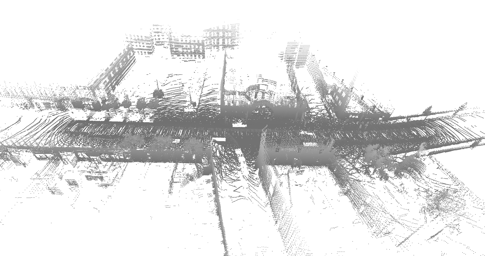
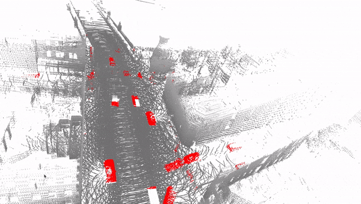
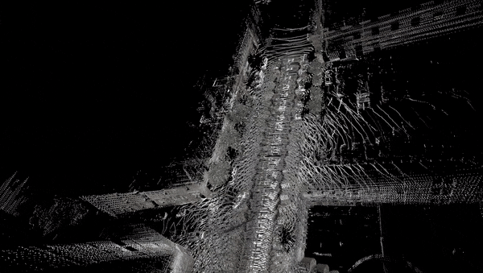

# nuScenes point cloud aggregation
## Download the dataset and Install nuScenes devkit
```sh
mkdir -p data/sets/nuscenes                         # Create folder to save the dataset in
wget https://www.nuscenes.org/data/v1.0-mini.tgz    # Download the mini split
tar -xf v1.0-mini.tgz -C data/sets/nuscenes         # Extract the mini split
pip install nuscenes-devkit &> /dev/null            # Install nuScenes.
```
## Run
```sh
chmod u+x main.py
./main.py
```
## outputs
  <p style="display:flex; flex-wrap:nowrap; gap:2px">
   &nbsp;&nbsp;
   &nbsp;&nbsp;
  </p><br>

## 
  <p style="display:flex; flex-wrap:nowrap; gap:2px">
   &nbsp;&nbsp;
   &nbsp;&nbsp;
   &nbsp;&nbsp;
  </p><br>
  