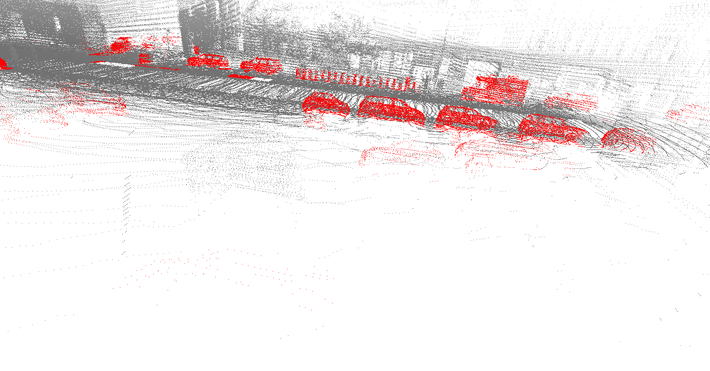
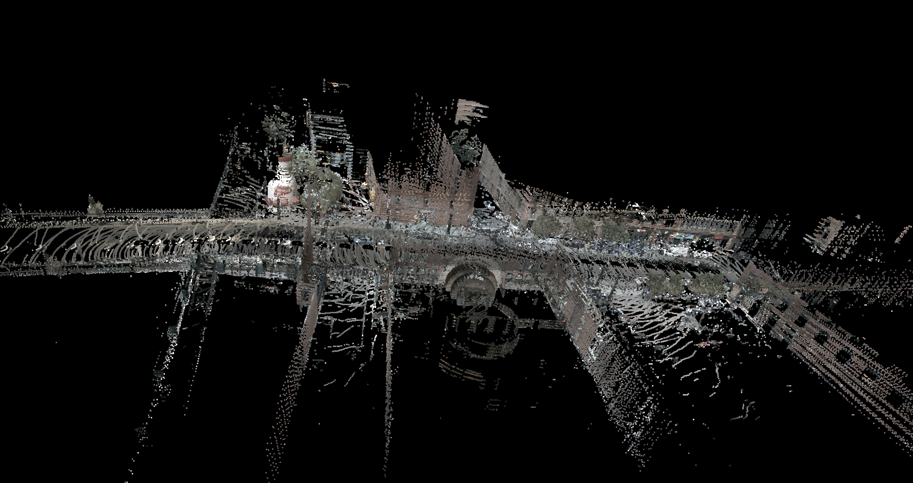

# nuScenes point cloud aggregation
## Download the dataset and Install nuScenes devkit
```sh
git clone git@github.com:ZewdieMc/nuScenes_pc_aggregation.git
cd nuScenes_pc_aggregation
mkdir -p data/sets/nuscenes                         # Create folder to save the dataset in
wget https://www.nuscenes.org/data/v1.0-mini.tgz    # Download the mini split
tar -xf v1.0-mini.tgz -C data/sets/nuscenes         # Extract the mini split
pip install nuscenes-devkit &> /dev/null            # Install nuScenes.
```
## Run
```sh
chmod u+x main.py
./main.py
```
## Approach and Methods
### 1. Aggregating Point Clouds
The `aggregate_pc` function aggregates point clouds from consecutive frames into a global coordinate system. It transforms the point clouds from the lidar frame to the global frame using the ego pose and sensor calibration data.

### 2. Detecting Moving Objects
The `detect_moving_objects` function identifies points corresponding to moving objects in the aggregated point cloud. It uses the annotations provided in the nuScenes dataset to determine the velocity of objects and filters out points belonging to objects moving with a velocity above a certain threshold.

### 3. Enhancing Point Cloud with Colors
The `enhance_point_cloud_with_colors` function enhances the static point cloud by assigning color values to the points using image data from the vehicle's cameras. It projects the 3D points onto the 2D image planes of the cameras and extracts the corresponding color values from the images. These extracted colors are used to enrich the point cloud visually in the open3D viewer.

### 4. Visualizing Point Clouds
The `draw_pc` function visualizes the point cloud using Open3D. It creates an Open3D point cloud object, assigns the points and colors, and displays the point cloud in a window.

## outputs
  <p style="display:flex; flex-wrap:nowrap; gap:2px">
  <figure style="display:inline-block;">
     &nbsp;&nbsp;
    <figcaption>Fig.1 - moving objects(red) filtered</figcaption>
  </figure>
  <figure style="dispaly:inline-block;">
     &nbsp;&nbsp;
    <figcaption>Fig.2 - Moving objects removed.</figcaption>
  </figure>
    <figure style="dispaly:inline-block;">
     &nbsp;&nbsp;
    <figcaption>Fig.3 - Color enhanced point clouds.</figcaption>
  </figure>
  </p><br>


  
## Video on youtube
[Watch the video here](https://youtu.be/9zdVQy2O1u0)

## Video on current folder
[Watch the video here](./aggregation.mp4)

